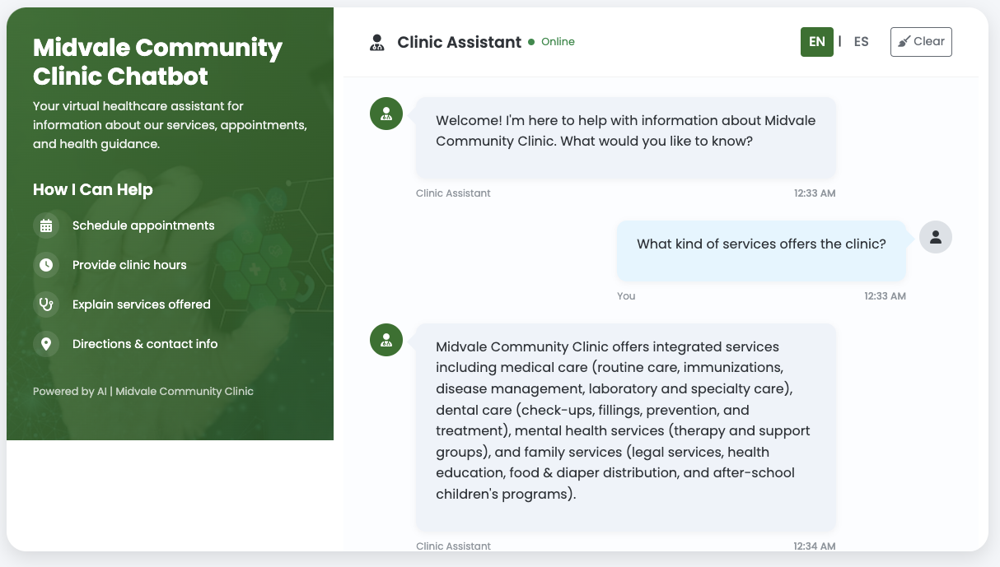
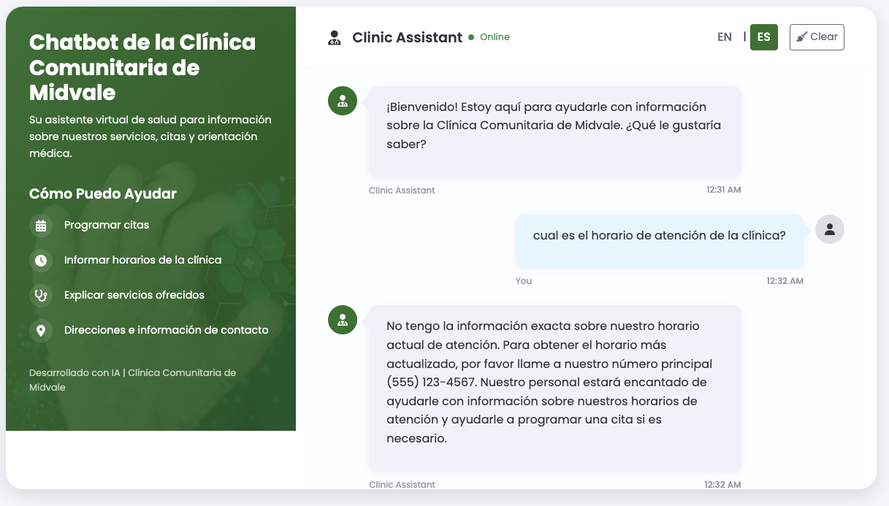

# Midvale Community Clinic Bilingual Chatbot

A fully responsive bilingual (English/Spanish) Flask-based chatbot application that answers questions about the Midvale Community Clinic using information extracted from the clinic's official website.

## Features

- **Fully Bilingual Support**: Complete interface and responses in both English and Spanish
- **Responsive Design**: Works perfectly on desktop, tablet, and mobile devices
- **Smart Fallback Responses**: Provides helpful information when specific data isn't available
- **Web Content Extraction**: Automatically extracts content from the clinic's official website
- **Intelligent Q&A**: Uses Google's Gemini AI to provide accurate responses to questions
- **User-friendly Interface**: Clean, responsive chat interface for easy interaction
- **One-click Language Toggle**: Instantly switch between English and Spanish interface and responses
- **Caching System**: Stores website content locally to reduce API calls and improve performance
- **Optimized for Full-screen**: Special handling for full-screen mode ensures usability

## Screenshots




## Getting Started

### Prerequisites

- Python 3.8 or higher
- Google AI Studio API key for Gemini

### Installation

1. **Clone the repository**
   ```bash
   git clone https://github.com/yourusername/midvale-clinic-chatbot.git
   cd midvale-clinic-chatbot
   ```

2. **Create and activate a conda environment**
   ```bash
   conda create -n clinic-chatbot python=3.10
   conda activate clinic-chatbot
   ```

3. **Install dependencies**
   ```bash
   pip install -r requirements.txt
   ```

4. **Set up your API key using conda environment variables**
   ```bash
   conda env config vars set GOOGLE_API_KEY=your-gemini-api-key-here
   ```

5. **Reactivate the environment to apply the variable**
   ```bash
   conda deactivate
   conda activate clinic-chatbot
   ```

### Running the Application

```bash
python main-website-langchain.py
```

Then open your browser and navigate to:
```
http://127.0.0.1:5000/
```

## Project Structure

```
midvale-clinic-chatbot/
├── data/
│   └── midvale_clinic_text.txt    # Cached content from the clinic website
├── templates/
│   └── index.html                 # Web interface template (responsive, bilingual)
├── main-website-langchain.py      # Main application file with bilingual support
├── requirements.txt               # Project dependencies
├── .env                           # Optional - for non-conda environments 
└── README.md                      # Project documentation
```

## How It Works

1. The application extracts content from the Midvale Community Clinic's official website using BeautifulSoup
2. Content is cached locally to improve performance and reduce API calls
3. When a user asks a question, the application:
   - Checks the user's language preference (English or Spanish)
   - Detects specific question types like appointment hours to provide standardized responses
   - Formulates a prompt using the extracted website content in the appropriate language
   - Sends the prompt to Google's Gemini AI
   - Processes and returns the response to the user in the selected language
4. The UI dynamically updates:
   - All UI elements adapt to the selected language
   - The responsive design adjusts to different screen sizes
   - Special handling ensures the chat is usable in full-screen mode

## Customization

### Changing the Target Website

To extract content from a different website, modify the `TARGET_URL` constant in the Python file:

```python
TARGET_URL = "https://www.example.com"
```

### Adjusting the Model

To use a different Gemini model, modify the model name in the `query_gemini` function:

```python
model = genai.GenerativeModel('gemini-1.5-pro')
```

## Troubleshooting

### Common Issues

- **API Key Not Found**: Ensure your API key is correctly set in your conda environment variables
- **Model Not Available**: Check that you're using a valid model name available in your region
- **Website Content Extraction Fails**: The website structure might have changed; inspect the HTML and update the extraction logic
- **Chat Messages Not Scrolling**: If you notice scrolling issues in the chat interface, check the CSS overflow properties and JavaScript scroll handling
- **Multiple Messages Not Working**: If you can't send multiple messages, ensure the input field is properly re-enabled after responses

### Debugging

The application uses Python's logging module. To see more detailed logs, set the logging level to DEBUG:

```python
logging.basicConfig(
    level=logging.DEBUG,
    format='%(asctime)s - %(name)s - %(levelname)s - %(message)s'
)
```

## Mobile and Full-Screen Optimizations

This chatbot includes specific optimizations for mobile devices and full-screen mode:

1. **Mobile Viewport Fix**: Uses a custom viewport height calculation to handle mobile browser issues
2. **Dynamic Height Adjustments**: Automatically recalculates heights when the screen size changes
3. **Sticky Input Area**: Ensures the input area is always accessible when scrolling through long conversations
4. **Responsive Design**: Adapts layout for different screen sizes (desktop, tablet, mobile)
5. **Landscape Support**: Works properly in both portrait and landscape orientations on mobile devices

## License

This project is licensed under the MIT License - see the LICENSE file for details.

## Acknowledgments

- Google's Gemini AI for powering the Q&A capabilities
- Flask and BeautifulSoup for web framework and content extraction
- Bootstrap and jQuery for responsive design and interactive elements